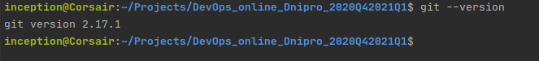
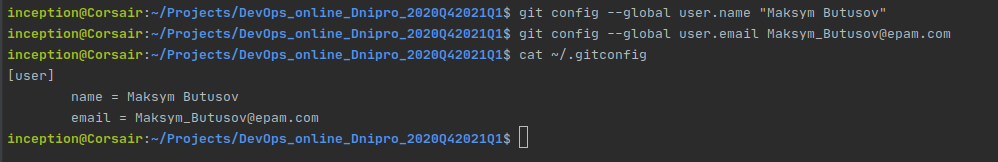

# HomeWork M1 Git - Task1.1

## Tasks: - [link](https://github.com/maksym-butusov/DevOps_online_Dnipro_2020Q42021Q1/blob/main/m1/task1.1/Task%201.pdf)

1. Install GIT on your workstation.  

2.Setup git: change your global configs (add name and email, setup core text editor).

  
